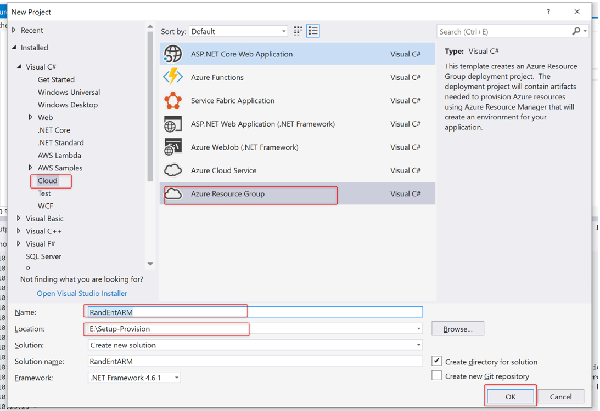
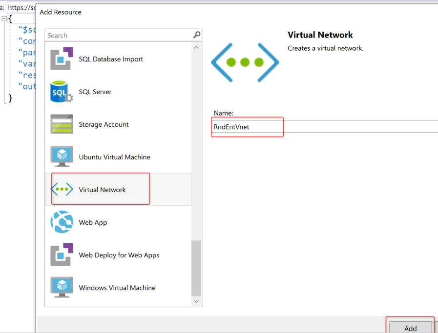
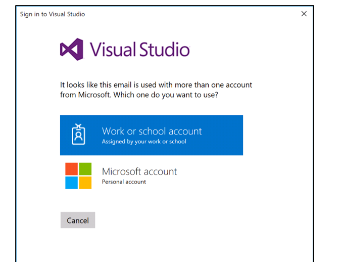
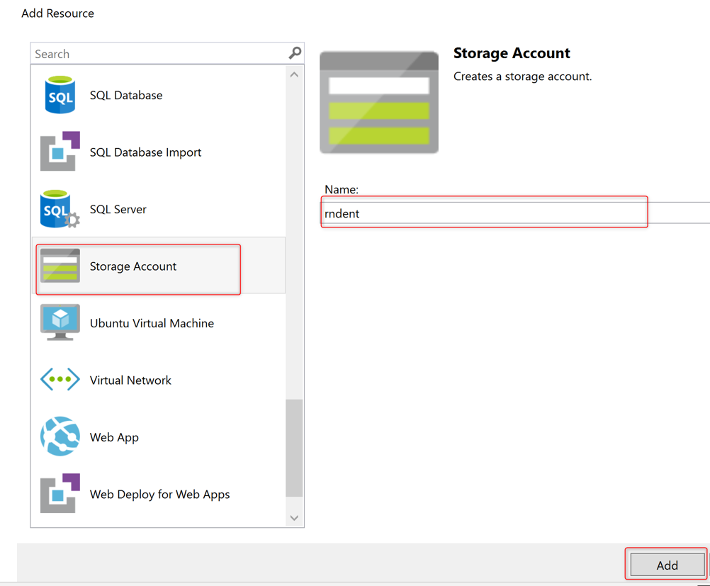
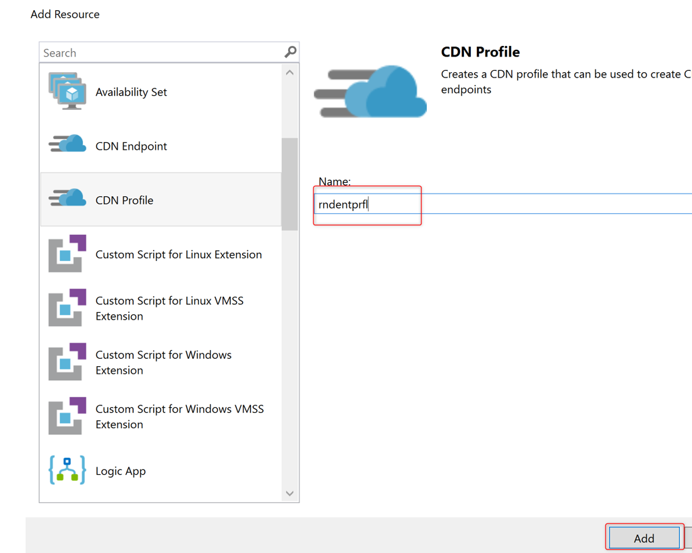

# Automating Workloads with ARM Templates

REnt Corporation aims to implement infrastructure as code by testing an ARM template. Project RandEnt is initiated to validate its functionality. The operations team plans to utilize the ARM template to define the networking architecture, followed by creating a storage account and virtual machines for their application. To ensure secure delivery of image-based content, communication between the VM application and Azure Storage account should occur within Azure's internal network. The team's goal is to develop a reusable template for automated deployment, enabling the provisioning of all resources in a template format rather than deploying them independently in Azure.

## Steps to be followed

1. Define the network
2. Extend that with Compute & Storage
3. Create the Storage account for Images & implement CDN

## Services

Azure virtual networks, Azure virtual machines,Public IP address, Storage account , CDN proflie and CDN End point

## Deployment steps and Screenshot

#### To deploy this project run ,

##### 1. Open Visual Studio Choose File, New Project, then choose Cloud, and then Azure Resource Group.

##### 2. choose the Blank Template

##### 3. Add Resource dialog box choose Virtual Network

##### 4. To deploy log on to your Microsoft Azure account

##### 5. Add a new Storage Account resource

##### 6. Add a Windows virtual machine

##### 7. Add a Public IP address

##### 8. Add CDN Profile and Endpoint with pricing tire of microsoft (classic)

## Documentation

[parameters](parameters.json)
[template](template.json)
