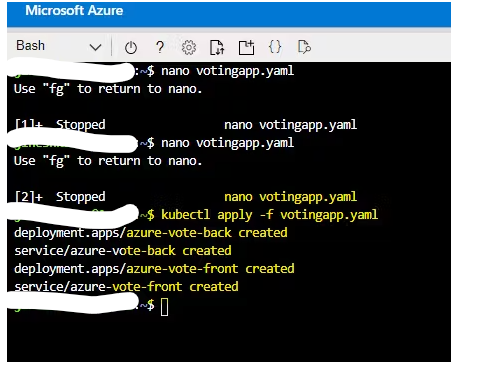

# Deploy Voting App using Azure Kubernetes Cluster

Azure Kubernetes Service (AKS) is a managed Kubernetes service that lets you quickly deploy and manage clusters
Basically, Kubernetes is a container orchestration tool When you deploy Kubernetes, you get a cluster. This Cluster has MASTER NODE and WORKER NODEs.
Run a multi-container application with a web front-end and a Redis instance in the cluster.

## Steps to be followed

1. Create an Azure Kubernetes Service (AKS) cluster using the Azure Portal.
2. Access the Azure Cloud Shell from the Azure Portal.
3. Get access credentials for the AKS cluster.
4. Deploy the multi-container application
5. Deploy the application using the `kubectl apply` command
6. Retrieve the public IP address of the application:
7. Monitor the nodes and cluster of your Voting App:

These steps provide a brief overview of deploying and testing a multi-container application using Azure Kubernetes Service.

## Services

Azure Kubernetes Service (AKS),Azure CLI , Azure Moniter

## Deployment steps and Screenshot

#### To deploy this project run ,

##### 1. Create Azure Kubernetes Cluster Service using Azure Portal

##### 1.1 On Azure Portal > Search Kubernetes Service > Create k8s Cluster and It will ask for Product details like Resource Group Name, Cluster Name, Region, Availability Zones, Kubernetes Version, Node Size, Scale Method(AutoScaling), Node Count Range (1-2).Configure those as you want then Review + Create As per,Validation passed > Create.Azure Kubernetes Cluster with 2 nodes on which we can deploy our Container-based Voting Application.Get into Azure Cloud Shell to run our k8s Cluster and Deploy our app.

##### 2. Open Azure CLI from the Azure Portal button from top-right corner. Bash Azure Cloud Shell will pop from the bottom Get access credentials for a managed Kubernetes cluster.

### 2.1 az aks get-credentials --resource-group YourResourceGroupNAME --name YourAKSClusterNAME

##### 3. Verify the connection to your cluster using the "kubectl get nodes" This command returns a list of the cluster nodes. (We have 2)Run the Application The sample Azure Vote Python applications. A Redis instance.

##### 4. First Create a file named votingapp.yaml I used nano editor to create, Edit, and save .yaml file.

-paste below content into the nano editor for votingapp.yaml file

### 4.1 run > nano votingapp.yaml

apiVersion: apps/v1
kind: Deployment
metadata:
name: azure-vote-back
spec:
replicas: 1
selector:
matchLabels:
app: azure-vote-back
template:
metadata:
labels:
app: azure-vote-back
spec:
nodeSelector:
"kubernetes.io/os": linux
containers: - name: azure-vote-back
image: mcr.microsoft.com/oss/bitnami/redis:6.0.8
env: - name: ALLOW_EMPTY_PASSWORD
value: "yes"
resources:
requests:
cpu: 100m
memory: 128Mi
limits:
cpu: 250m
memory: 256Mi
ports: - containerPort: 6379
name: redis

---

apiVersion: v1
kind: Service
metadata:
name: azure-vote-back
spec:
ports:

- port: 6379
  selector:
  app: azure-vote-back

---

apiVersion: apps/v1
kind: Deployment
metadata:
name: azure-vote-front
spec:
replicas: 1
selector:
matchLabels:
app: azure-vote-front
template:
metadata:
labels:
app: azure-vote-front
spec:
nodeSelector:
"kubernetes.io/os": linux
containers: - name: azure-vote-front
image: mcr.microsoft.com/azuredocs/azure-vote-front:v1
resources:
requests:
cpu: 100m
memory: 128Mi
limits:
cpu: 250m
memory: 256Mi
ports: - containerPort: 80
env: - name: REDIS
value: "azure-vote-back"

---

apiVersion: v1
kind: Service
metadata:
name: azure-vote-front
spec:
type: LoadBalancer
ports:

- port: 80
  selector:
  app: azure-vote-front

##### 5.Deploy the application using the "kubectl apply" specify the name of your YAML manifest file. as p

kubectl apply -f votingapp.yaml

##### 6. Our Voting App is deployed successfully when you get that "azure-vote-back" and "azure-vote-front" get created.

##### 7. Now it's about time to TEST Out the App. We need the Public IP Address. To get our deployment has created an external IP, run below command

kubectl get service azure-vote-front –watch

##### 8. This shows our Application's external Public IP address.

## Documentation

[parameters](parameters.json)
[template](template.json)
