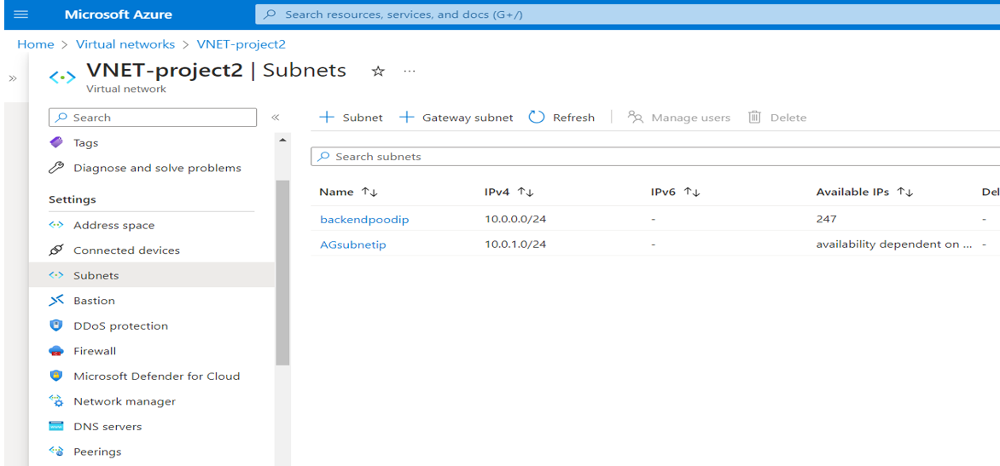

# Deploying Azure protected Geo-Redundant Solution having path based routing.

The Tyrell Crop aims to develop a globally distributed application with robust security measures. The application handles two types of content: images and dynamically rendered webpages. To ensure low latency and geographical redundancy, the design necessitates serving users from the closest location. Notably, URLs matching the pattern /images/\* are served from a dedicated pool of VMs separate from the web farm.

## Steps to be followed

1.  Virtual network with two subnet
2.  Virtual machines are created and installed IIS server
3.  Application gateway with backendpool with image/\* path

## Resource visualizer(Architect Diagram)

## Services

Azure virtual networks, Azure virtual machines,Application Gateway

## Deployment steps and Screenshot

### To deploy this project run ,

#### 1. Resource Group.

#### 2. Virtual network VNET-project2 with 2 subnet backendpool and AGsubnetip is for Application gateway

#### 3. Virtual machines are created vm1 and vm2 and installed IISA server and for vm2 in rootiisa folder image folder and html doc. Is created for image/\* path URL

#### 4. Application gateway is created backendpool with pool as the web server vm1 and image as the vm2 with image/\* path

#### 5. rules with http and added the path-based as /image/\*

#### 6. listeners to a HTTP port 80 request with public forntendip and rule

#### 7. With path URL as default http://yourfrontendipaddress vm1 web server is display

#### 8. With path URL with image/test.htm file http://yourfrontrndipaddress/image/test.htm vm2 web server is display

## Documentation

[parameters](parameters.json)
[template](template.json)
