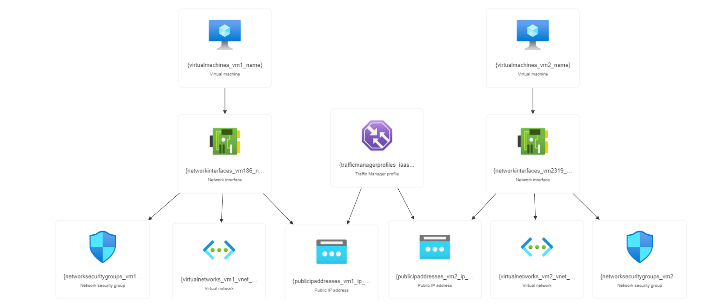

## Approach in IaaS

### Steps to be followed

1. Creating virtual machines
2. Adding DNS names to virtual machines
3. Creating Traffic Manager
4. Testing Traffic Manager endpoints

## Services

Azure virtual networks, Azure virtual machines,Traffic manager

## Resource visualizer(Architect Diagram)

## Deployment steps and Screenshot

### To deploy this project run ,

#### 1. Create an Virtual Machines in Standard Tier and choose the different region

#### 2. inbound traffic on port 80 and port 443 open.

#### 3. Connect and select RDP file and Open the powershell and type the following command:

" Install-WindowsFeature -name Web-Server -IncludeManagementTools "

#### 4. The above command will create an inetpub folder in your C drive. Go to "C:\inetpub\wwwroot" and copy-paste the index.html file of your application which you want to deploy here

#### 5. Enter the DNS name in virtual netwotk ip-configuration save

##### 6. create the Traffic Manager Profile

##### 7. Add a Public IP address Create endpoints in the traffic manager corresponding to the public IP of each virtual machine that created

##### 8.Once the monitor status is online, copy the link of the DNS name and check whether the application is online

## Documentation

[parameters](parameters.json)
[template](template.json)
