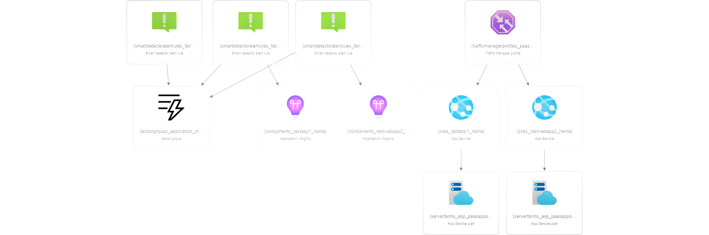

## Approach in PaaS

### Steps to be followed

1. Creating webapp
2. Creating Traffic Manager
3. Testing Traffic Manager endpoints

## Services

Azure webapp,Traffic manager

## Resource visualizer(Architect Diagram)

## Deployment steps and Screenshot

### To deploy this project run ,

#### 1. Create an App Service (Web Apps) using the App Service Plan in Standard Tier and choose the different region

#### 2. Choose the runtime stack as ASP.NET V4.7 or .NET6

#### 3. Deploy your static web app to Azure App Service (Web App) using a method of your choice such as Visual Studio Code, GitHub, or FTP

#### 4. create the Traffic Manager Profile and add endpoints(target resource type is app service)

#### 5. Once the monitor status is online, copy the link of the DNS name and check whether the application is online

## Documentation

[parameters](parameters.json)
[template](template.json)
