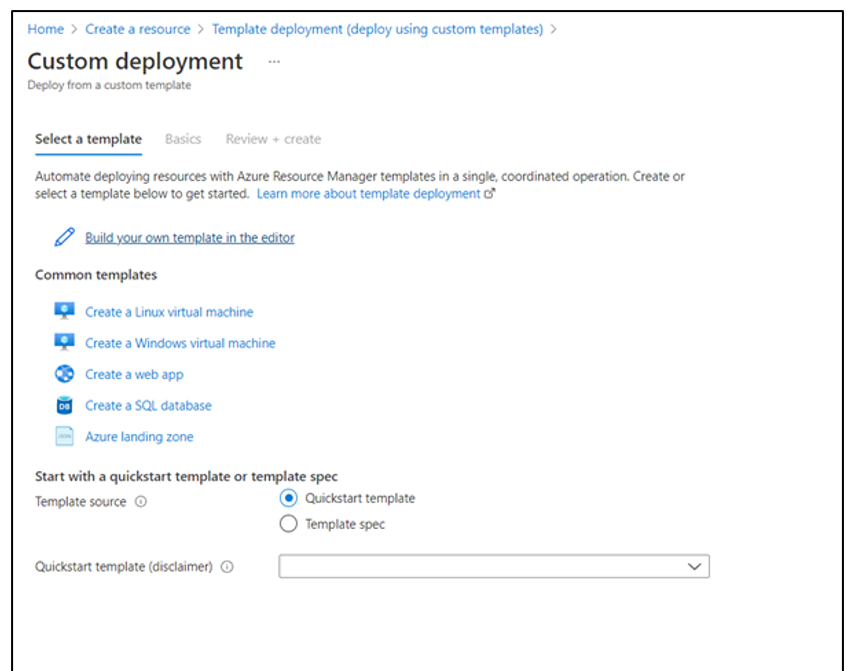
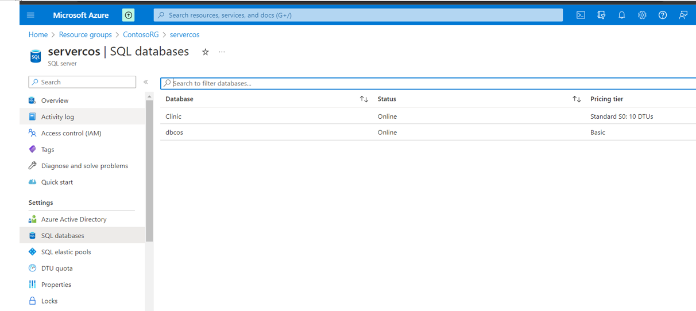
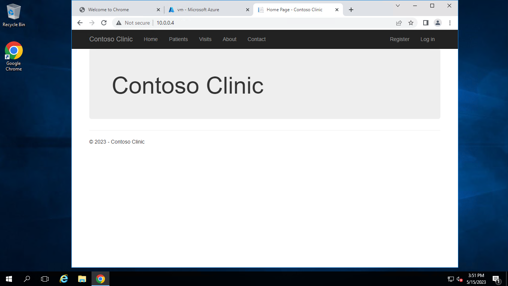
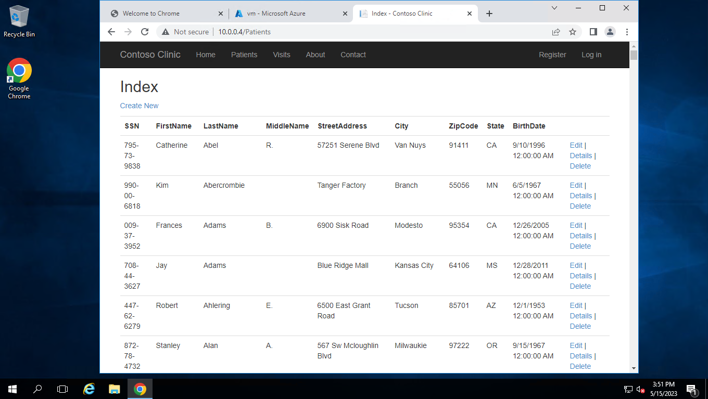
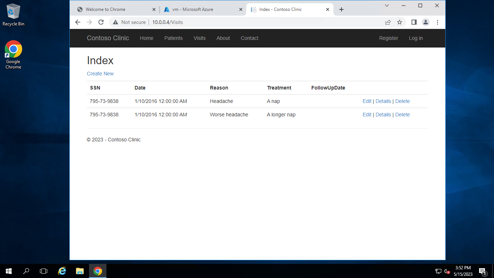

# Implementing High Availability for an Application

Contoso clinic, a reputable clinic with offices in Alpharetta and Dallas, relies on a mission-critical website for patient management and appointment scheduling. Ensuring high availability is crucial to prevent business losses. The IT department seeks assistance in securely storing confidential patient data and migrating the website to Azure for leveraging its advanced features. Additionally, they require a backup strategy to safeguard against potential disasters.

## Steps to be followed

1. Creating 2 VMs using ARM template in region 1
2. Create a subnet for the bastion host and create a bastion
3. Install IIS on contoso-vm0 and contoso-vm1
4. Connect 2 VMs using a bastion
5. Download the source code
6. Create Azure SQL using an ARM template
7. Import database using the import option in Azure SQL in the portal
8. Change the connection string and copy the connection details on the web.config file

## Services

Azure virtual networks, Azure virtual machines,ARM template,SQL database

## Deployment steps and Screenshot

### To deploy this project run ,

#### 1. Creating Two VMs using ARM template in region one

#### 2. Create Azure SQL using ARM template and Upload the same source code

#### 3. Import the database

#### 4. Test the app and visit the patients’ page to verify the data with private IP address

## Documentation

[parameters](parameters.json)
[template](template.json)
