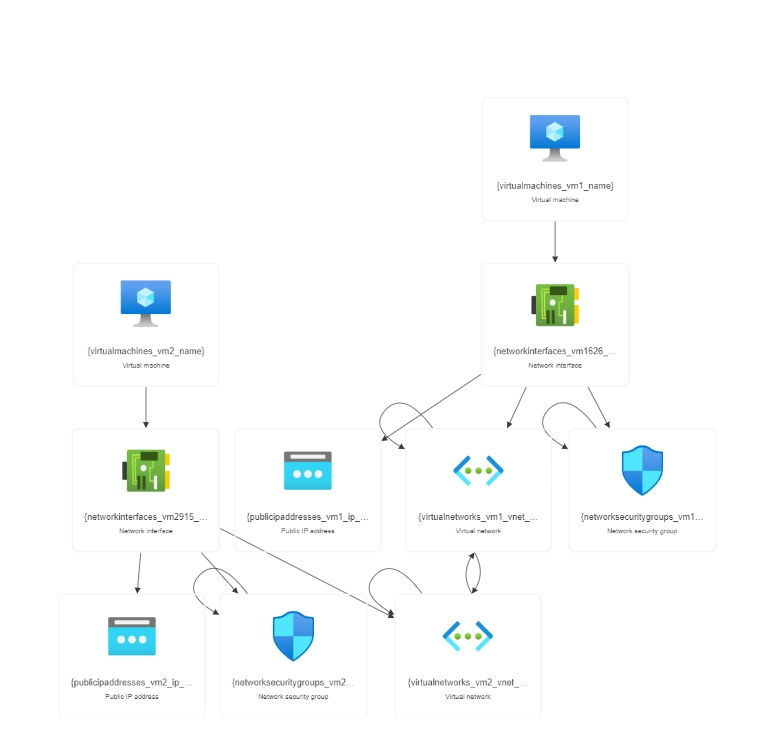

# Implement Azure IaaS

The XYZ Corporation,They have their headquarters in East US with another branch office in SouthEast Asia. a globally distributed firm, plans to deploy their project's application tier in a branch region while keeping the data tier in the headquarter region for security purposes. They are considering Azure as a deployment platform and need to set up separate virtual networks for the application and data. Additionally, connectivity between the branch office and headquarter's virtual networks will be established, and a test virtual machine will be deployed to verify the connection before performing a Ping test for validation.

## Steps to be followed

1. Create virtual networks in the a mentioned region
2. Create test virtual machines in both the virtual networks
3. Establish the connectivity between both the networks via VNet peering
4. Ensure connectivity is established properly

## Services

Azure virtual networks, Azure virtual machines

## Resource visualizer

Architect Diagram

## Documentation

[parameters](parameters.json)
[template](template.json)
