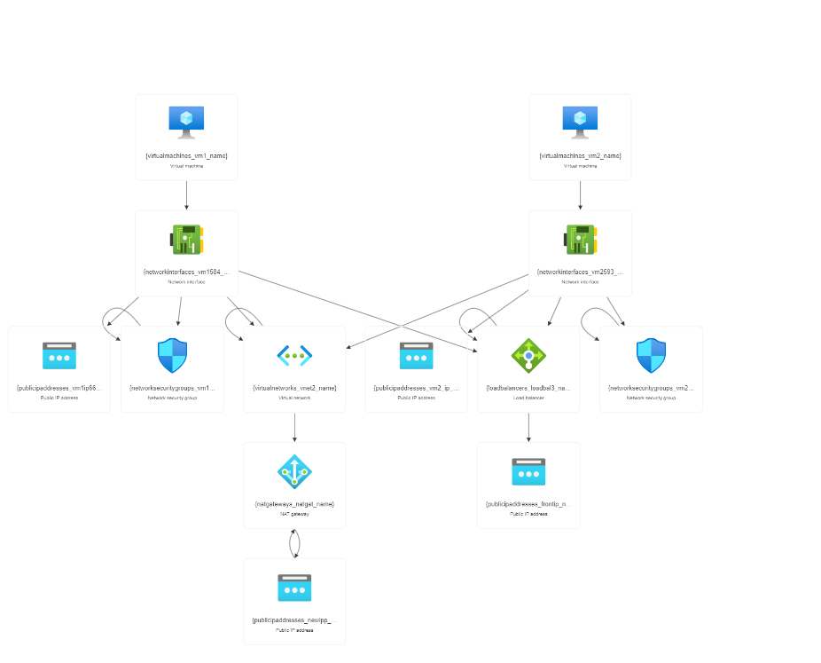

# Load Balancing Incoming Traffic for Cloud Services

REnterprises Corporation is to deploy a highly available web application using Azure public load balancer to ensure uninterrupted service for end users. They aim to define the architecture using load balancer, backend pool, frontend IP, and health probe, while keeping virtual machines secure from direct exposure to the internet. The operations team seeks to create a reusable automation method using command-line interface for future deployments and ensure that only healthy instances serve the traffic for security purposes.

## Steps to be followed

1. Creating Test Virtual Machines and Virtual Network
2. Installed IIS web server
3. Created NAT gateway for outbound flow
4. load balancer the incoming traffic among healthy service
5. command-line interface to deploy the resources

## Services

Azure virtual networks, Azure virtual machines,Access Control (IAM)

## Resource visualizer(Architect Diagram)



## Documentation

[parameters](parameters.json)
[template](template.json)

## Usage

#### Azure clous shell to deploy the resources

```
az network public-ip show
–resource-group lab3
–name LBfrountip
–querty ipaddress
–output tsv

```
