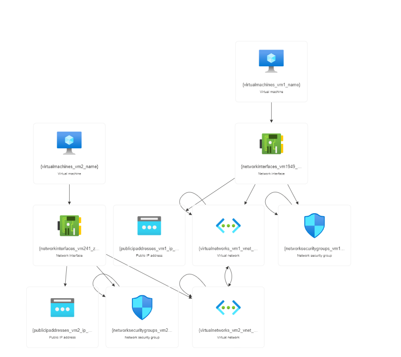

# Vnet Peering and Assigning a Custom RBAC role

RE Corporation is assessing Azure as a deployment platform. To assist with the evaluation, virtual networks need to be created in the specified region. Test virtual machines must be deployed in two virtual networks, with connectivity established via VNet peering. An employee will be onboarded to the default Azure Active Directory, assigned a Custom RBAC role allowing read access to network, storage, and VMs, along with permission to start and restart VMs. Security measures will be implemented to enforce least privilege access to resources within the custom role.

## Steps to be followed

1. Creating Test Virtual Machines and Virtual Networks
2. Establishing Vnet Peering
3. Testing connectivity
4. Creating a custom RBAC Role
5. Adding a user to the Directory and Assign the custom RBAC Role

## Services

Azure virtual networks, Azure virtual machines,Access Control (IAM)

## Resource visualizer(Architect Diagram)



## Documentation

[parameters](parameters.json)
[template](template.json)

## Usage

#### In access control(IAM) add custom role with this permissions

```
Microsoft.Compute/virtualMachines/read
Microsoft.Compute/virtualMachines/start/action
Microsoft.Compute/virtualMachines/restart/action Microsoft.Network/virtualNetworks/read
Microsoft.Storage/storageAccounts/read/

```
